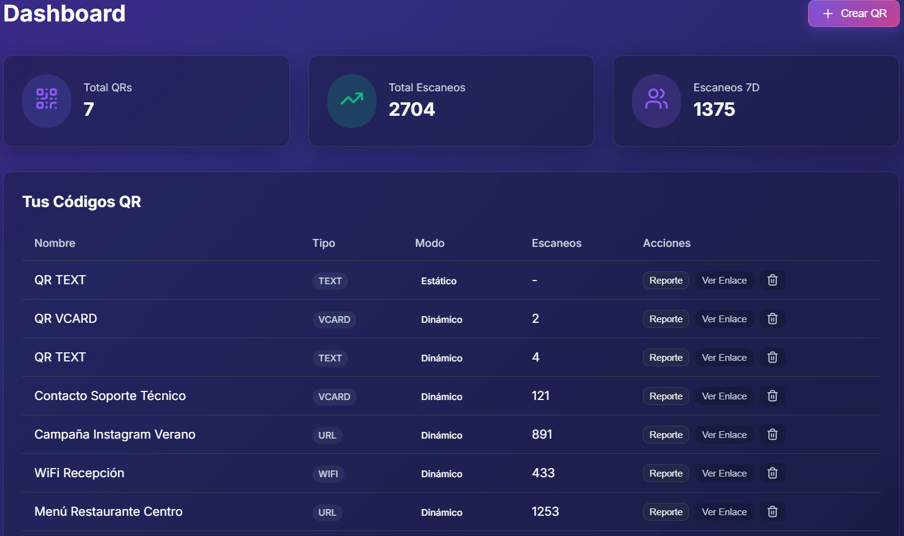
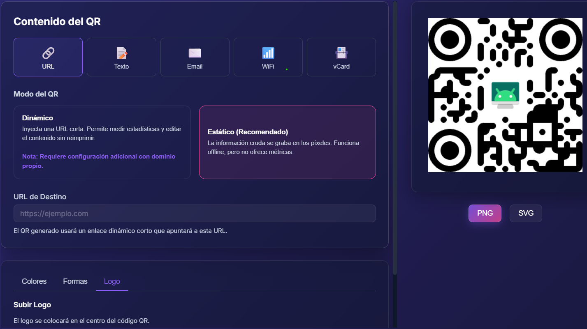
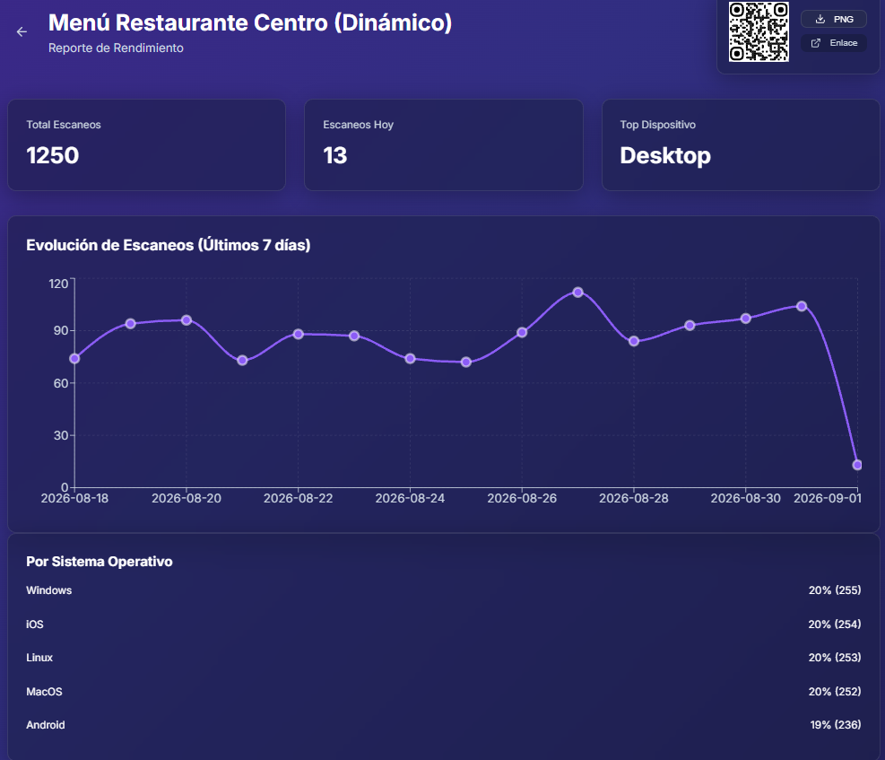

# 📱 Plataforma de Códigos QR (Estáticos y Dinámicos)

¡Bienvenido! Este es un proyecto para crear, gestionar y analizar códigos QR. Está construido con una arquitectura moderna (React, Node.js y PostgreSQL) y un diseño visual muy atractivo conocido como **Glassmorphism** (efecto cristal).

Si eres un desarrollador Junior, este proyecto es excelente para aprender sobre contenedores (Docker), bases de datos relacionales, manejo de estados globales (Zustand) y generación de gráficos estadísticos (Recharts).

---

## 📸 Capturas de Pantalla

<div align="center">
  
  
  <br>
  
  
</div>

---

## 🎯 ¿Qué hace este proyecto?

Permite a los usuarios:
1. **Crear diferentes QRs**: Enlaces (URL), Textos, Emails, vCard (tarjetas de contacto) y credenciales WiFi.
2. **Personalizar el diseño**: Cambiar colores, formas de los puntos y añadir logos al centro.
3. **Elegir entre dos modos**:
   - **Estático (Por Defecto)**: Guarda el texto directamente en los píxeles de la imagen del QR. Funciona sin internet.
   - **Dinámico**: Guarda un "enlace corto" (ej. `tusitio.com/q/123`). Al escanearlo, el servidor cuenta la visita (país, sistema operativo) y luego redirige al usuario a su destino real.

---

## 🏗️ ¿Con qué tecnologías está hecho?

Está dividido en dos partes principales que se comunican entre sí a través de una API REST:

### Frontend (Lo que ve el usuario)
- **React con Vite**: Para construir la interfaz de forma rápida y moderna.
- **Zustand**: Para guardar datos que se comparten entre varias pantallas (como el usuario logueado).
- **qr-code-styling**: Una librería que dibuja los QR usando `Canvas` y `SVG` para que no pierdan calidad.
- **Recharts**: Para dibujar los gráficos de líneas y barras en el panel de estadísticas.

### Backend (El motor oculto)
- **Node.js con Express**: Recibe las peticiones, gestiona la base de datos y hace las redirecciones dinámicas.
- **Prisma ORM**: Una herramienta muy amigable para hablar con la base de datos sin escribir SQL puro.
- **PostgreSQL**: La base de datos relacional donde se guarda toda la información.

---

## 🚀 ¿Cómo lo instalo en mi computadora?

Hemos configurado **Docker** para que no tengas que instalar Node.js ni PostgreSQL manualmente en tu PC. Docker creará "cajas" (contenedores) con todo lo necesario instalado dentro.

1. **Configura tus variables**
   Crea un archivo llamado `.env` en la misma carpeta raíz del proyecto y pega esto:
   ```env
   # Configuración de Base de Datos
   DATABASE_URL=postgresql://qruser:qrpassword@db:5432/qrplatform

   # Cuenta de Administrador por defecto
   ADMIN_EMAIL=admin@qrplatform.com
   ADMIN_PASSWORD=admin123
   JWT_SECRET=super-secret-jwt-key

   # Puertos y URLs de la Aplicación
   PORT=3001
   NODE_ENV=development
   BASE_URL=http://localhost:3001
   FRONTEND_URL=http://localhost:5173

   # Configuración para subir imágenes (logos)
   MAX_FILE_SIZE=10485760
   UPLOAD_DIR=./uploads
   ```

2. **Levanta el proyecto**
   Abre tu terminal en esa carpeta y ejecuta:
   ```bash
   docker-compose up --build -d
   ```
   *Esto descargará lo necesario y encenderá la aplicación en segundo plano.*

3. **¡Entra a la aplicación!**
   - Abre tu navegador en `http://localhost:5173`
   - Inicia sesión con el correo y contraseña que configuraste en tu archivo `.env`.

---

## 📱 Probar los QR con tu Teléfono (¡Importante!)

Aquí hay un detalle clave que debes conocer como desarrollador cuando estás probando en tu entorno local (localhost):

**Si creas un QR Estático:**
Al escanearlo con la cámara de tu teléfono, leerá directamente el texto que grabaste (ej. "Hola Mundo" o la contraseña de un WiFi). **¡Funcionará a la perfección sin hacer nada más!**

**Si creas un QR Dinámico:**
El código QR tendrá grabado un enlace local (ej. `http://localhost:3001/q/ID`). Si escaneas eso con tu teléfono, el teléfono buscará ese servidor **dentro de sí mismo** y dará error, porque el servidor no está en el teléfono, ¡está en tu computadora!

Para poder escanear y probar las métricas de los QRs dinámicos con tu teléfono celular, usa **Port Forwarding (Puertos Compartidos)** de Visual Studio Code:

1. Ve a la pestaña de **Puertos (Ports)** en la parte de abajo de VS Code (junto a la Terminal).
2. Dale clic a **Forward a Port** y añade el puerto `5173` (Frontend) y `3001` (Backend).
3. Haz clic derecho en ambos, ve a **Port Visibility** (Visibilidad) y cámbialos a **Public** (Público).
4. VS Code te dará URLs reales de internet (ej. `https://tu-usuario-3001.github.dev.com`).
5. Ve a tu archivo `.env`, cambia las variables `BASE_URL` y `FRONTEND_URL` por esas nuevas URLs públicas.
6. Reinicia el proyecto ejecutando `docker-compose up --build -d`.
7. ¡Listo! Crea un nuevo QR dinámico. Ahora tendrá una URL pública real que cualquier teléfono podrá alcanzar para sumar escaneos en tus estadísticas.

---

## 🔍 Trucos Técnicos del Proyecto (¡Para aprender!)

### ¿Por qué los QRs descargados se ven mejor que los de la pantalla?
Para que la página web sea rápida, el QR se dibuja pequeño en la pantalla. Pero cuando el usuario hace clic en "Descargar PNG", nuestro código JavaScript vuelve a generar el QR de forma *invisible* en ultra-alta definición (1024x1024) y le entrega ese archivo gigante al usuario. Así logramos velocidad y máxima calidad de impresión al mismo tiempo.

### La magia detrás de las Redirecciones Nativas (Dinámicas)
Cuando un celular escanea un **QR Dinámico de tipo vCard (Contacto)**, hace una visita rápida a nuestro servidor (`redirectController.js`). El servidor anota en la base de datos que hubo una visita y, en lugar de devolver una página web, devuelve directamente un archivo binario `.vcf`. Al recibir un archivo `.vcf`, el teléfono (iPhone o Android) reacciona abriendo nativamente la aplicación de "Contactos" para sugerirte guardarlo. ¡Así es como interactuamos con el sistema operativo del usuario desde el servidor!
